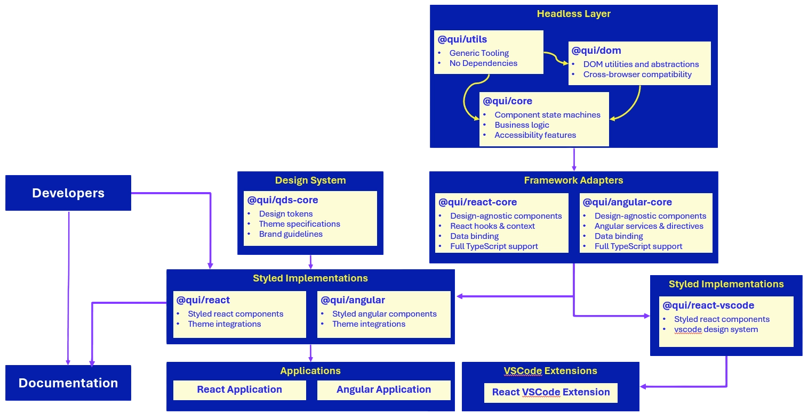

# Architecture

## Overview

This is a multi-layer component architecture with framework-agnostic core logic:

### Headless Layer

- `@qui/utils`: Generic tooling, zero dependencies
- `@qui/dom`: DOM abstractions, cross-browser compatibility
- `@qui/core`: State machines, component business logic, accessibility

The core is framework-agnostic. `@qui/core` depends on `@qui/dom` and `@qui/utils`, implementing component behavior as state machines (inspired by [zag.js](https://zagjs.com/overview/introduction)).

### Framework Adapters

- `@qui/react-core`: React bindings (hooks, context, data binding)
- `@qui/angular-core`: Angular bindings (services, directives, data binding)

These wrap the headless core for specific frameworks without adding styling.

### Design System

- `@qui/qds-core`: Design tokens, theme specs, brand guidelines

Separate from component logic.

### Styled Implementations

- `@qui/react`: React components with theme integration
- `@qui/angular`: Angular components with theme integration
- `@qui/react-vscode`: React components with VSCode design system

These combine framework adapters + design system to produce styled components.

### Flow

1. Core logic is framework-agnostic (state machines, accessibility)
2. Framework adapters provide bindings and reactivity
3. Styled implementations merge adapters + design tokens
4. Applications consume styled implementations

**Key difference from typical architectures**: Business logic lives in headless core, not in framework-specific code. Multiple framework implementations share the same behavior, similar to zag.js's approach of state machines + adapters.

This architecture gives us maximum code reuse, framework-native DX, consistent behavior across frameworks, centralized design management, and the flexibility to support new frameworks.

## Why Not Web Components?

Web components promise framework-agnostic reusability through encapsulation. The reality is more complicated.

### Wrappers Defeat the Purpose

Teams implementing web components for framework integration inevitably create framework-specific adapters. These wrappers exist to provide functionality web components can't natively support in Angular and React:

#### Angular

- Two-way data binding (`[(ngModel)]`)
- Reactive forms (`formControl`, `formControlName`)
- Template references (`viewChild,` `contentChild`)

#### React

- Refs to internal elements (Shadow DOM blocks this)
- Context API across Shadow boundaries
- Controlled component patterns for forms

Shadow DOM encapsulation prevents binding directly to internal elements. If a web component contains an `<input>`, you can't apply Angular's `formControlName` or React's `ref` to that input—only to whatever the web component explicitly exposes through its public API.

If you need framework-specific wrappers anyway, you've negated the primary benefit: framework independence. You're maintaining both the web component and the adapters.

### Industry Patterns

Research into major design systems reveals a consistent pattern: framework-specific implementations are the norm.

IBM Carbon and Microsoft Fluent UI maintain separate implementations for frameworks and web components. Since early 2023, Carbon has [expanded](https://carbondesignsystem.com/#explore-libraries) framework-specific implementations rather than consolidating around web components. Most companies default to React. These teams recognized that deep framework integration requires native implementations.

This isn't an oversight. Framework-specific libraries dominate because they can leverage each framework's full capabilities.

### Technical Limitations

**Server-Side Rendering:** Adding a web component to Next.js or Remix crashes the server (at the time of this writing, aka late 2025). You can patch around this by rendering client-only, but that causes severe FOUC and bypasses SSR entirely. Declarative Shadow DOM may address this for vanilla JavaScript, but its viability in serverside-rendered Angular and React remains unproven.

The problem goes deeper. SSR has no standard for web components. Lit's approach is different from Stencil's, which is different from Fast's. You're back to framework-specific solutions with no more guarantees than choosing Vue or React.

**Framework Integration:** Complex components with interconnected state benefit from framework-native state management and reactivity. Web components can't tap into React's state handlers or Angular's change detection the way native components can. Wrappers can't expose internal elements to framework-specific bindings. They're limited to whatever surface API the web component provides. This matters for complex components where you'd normally want direct access to child elements: form controls, composite components, anything requiring fine-grained framework integration with internals.

### The Wrong Abstraction

Elements are not the right abstraction for components. Elements require a DOM interface. Components don't. When you make components elements, every interaction must go through DOM constraints:

Elements impose runtime presence, DOM lifecycle coupling, attribute/property duality, and event retargeting rules. These constraints exist to make elements work as DOM primitives.

Not all components need to be DOM primitives. Many components are just logical groupings of UI that could be compiled away entirely. Forcing them through the element abstraction adds constraints without corresponding benefit.

### The Real Cost

Web components are a compromise. At best, they're nominal overhead and convenient reuse. At worst, they impose costs on everyone: users of web components, users of frameworks that support them, and users of the web platform as it evolves around this abstraction.

The promise of universal portability is alluring but misaligned with reality. The decision to build with web components is orthogonal to building for the future. In 10 years a well-chosen framework will likely compare favorably the web component version built today.

## Our Investment

We've invested in Angular and React tooling because it's what Qualcomm is using today. It enables patterns that aren't possible or practical with web components. Deep framework integration makes our components convenient and powerful to use. We're not anti-web components. We're pro-framework, and we need solutions that work with those frameworks.

### True Framework Agnosticism

Our cross-framework architecture decouples behavior from framework bindings. Each framework gets a native implementation that feels natural to that ecosystem while sharing the same underlying state machine and logic.
