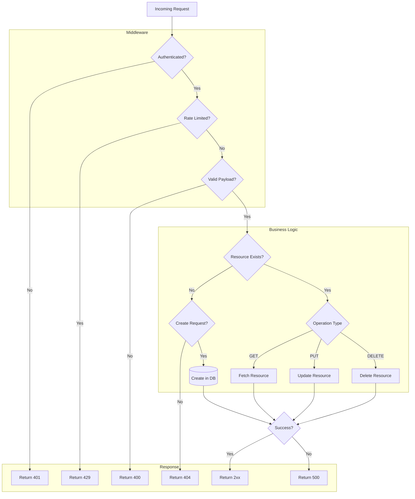
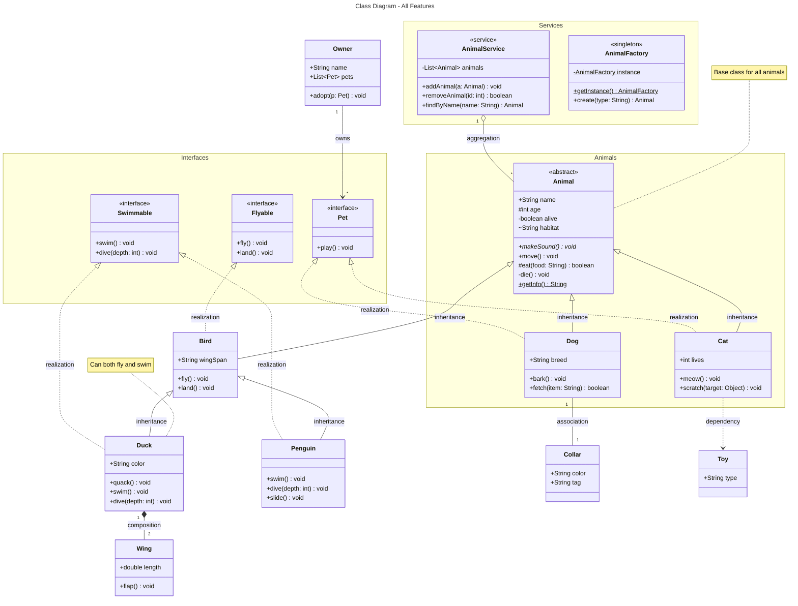
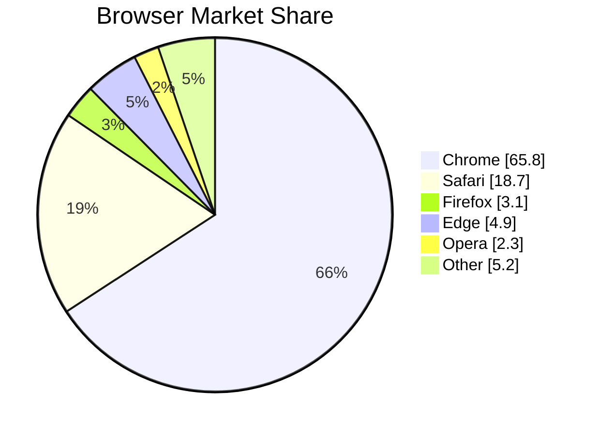
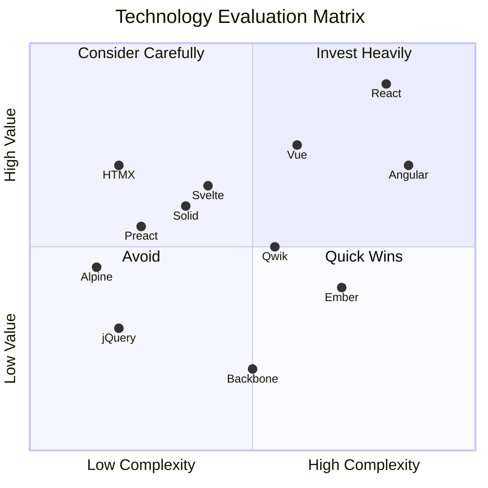
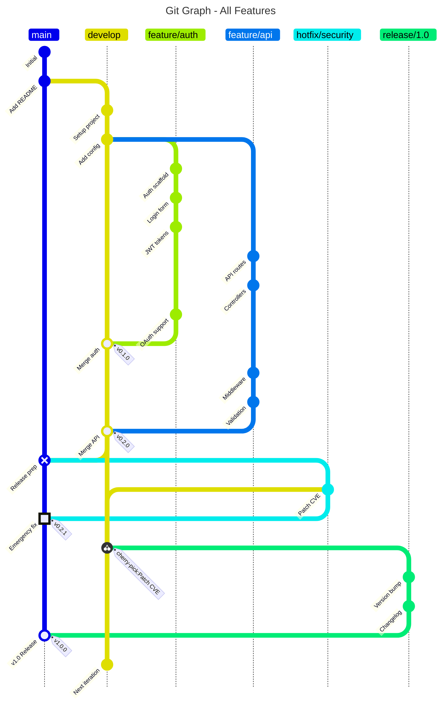
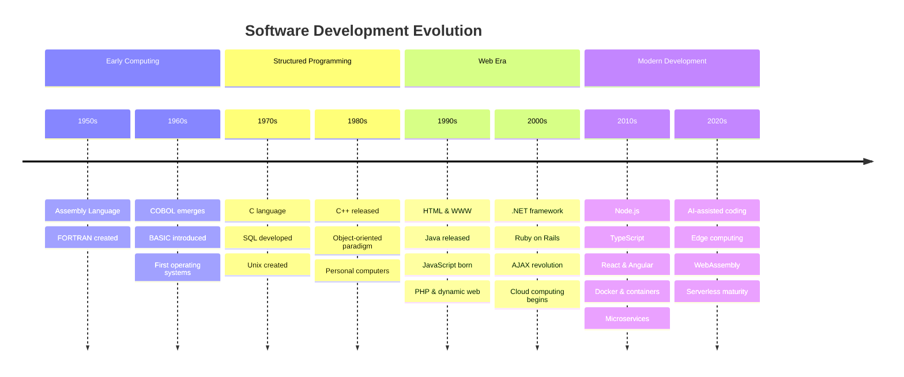

import {Button} from "@qualcomm-ui/react/button"

# {frontmatter.title}

Markdown is convenient. React makes it even better.

## MDX

Our framework leverages MDX to offer a powerful and flexible content authoring experience. It's an advanced Markdown format with React component support.

For example, you can use and import React components inside your markdown like this:

```mdx
import {Button} from "@qualcomm-ui/react/button"

<Button emphasis="primary" variant="fill">
  Hello!
</Button>
```

<br />

<Button emphasis="primary" variant="fill">
  Hello!
</Button>

### Frontmatter

[Frontmatter](https://jekyllrb.com/docs/front-matter/) is used to add metadata to Markdown files. It's also the only good thing to come from Jekyll. It's placed at the top of the Markdown file enclosed in `---` lines. You can access frontmatter variables in the markdown body using the `frontmatter` keyword enclosed in brackets.

```markdown
---
title: Example Page
---

# {frontmatter.title}

This is the content of my page.
```

For a list of each available property, refer to the [PageFrontmatter API](/api/page-frontmatter).

## Markdown Features

In addition to standard markdown, QUI Docs also supports GitHub Flavored Markdown (GFM). These extensions make it easier to write rich content with enhanced formatting and functionality. The following features are a mix of standard markdown, GFM, and our own enhancements.

### Autolink Headings

Heading elements `h2`, `h3`, and `h4` create anchor links and comprise the page's Table of Contents.

### Font Styles

| Syntax              | Result            |
| :------------------ | :---------------- |
| `**bold**`          | **bold**          |
| `_italic_`          | _italic_          |
| `~~strikethrough~~` | ~~strikethrough~~ |
| \`code\`            | `code`            |

### Lists

Lists denote nesting with alternating list styles based on the nesting level.

#### Ordered Lists

```markdown
1. Parent
   1. Child
   2. Child
      1. Grandchild
      2. Grandchild
2. Parent
3. Parent
```

1. Parent
   1. Child
   2. Child
      1. Grandchild
      2. Grandchild
2. Parent
3. Parent

#### Unordered Lists

```markdown
- Parent
  - Child
  - Child
    - Grandchild
    - Grandchild
- Parent
- Parent
```

- Parent
  - Child
  - Child
    - Grandchild
    - Grandchild
- Parent
- Parent

### Tables

```markdown
| Syntax    | Description |   Test Text |
| :-------- | :---------: | ----------: |
| Header    |    Title    | Here's this |
| Paragraph |    Text     |    And more |
```

| Syntax    | Description |   Test Text |
| :-------- | :---------: | ----------: |
| Header    |    Title    | Here's this |
| Paragraph |    Text     |    And more |

### Mermaid

Unsupported:

- ERD
- Gantt Chart
- Mindmap
- Sankey
- Sequence Diagram

#### Flow Chart



#### Class Diagram



#### Pie Chart



#### Quadrant Chart



#### Git Graph



#### Timeline



#### Quadrant Chart


### Code Blocks

Code blocks are syntax highlighted using [Shiki](https://shiki.style/guide/). We've enabled most [common transformers](https://shiki.style/packages/transformers#transformers) by default, detailed below:

#### Diff Notation

Use `[!code ++]` and `[!code --]` to mark added and removed lines.

````markdown
```ts
console.log("hewwo") // [\!code --]
console.log("hello") // [\!code ++]
console.log("goodbye")
```
````

```ts
console.log("hewwo") // [!code --]
console.log("hello") // [!code ++]
console.log("goodbye")
```

#### Line Highlighting

Use `[!code highlight]` to highlight a line.

````markdown
```ts
console.log("Not highlighted")
console.log("Highlighted") // [\!code highlight]
console.log("Not highlighted")
```
````

```ts
console.log("Not highlighted")
console.log("Highlighted") // [!code highlight]
console.log("Not highlighted")
```

You can also highlight multiple lines with a single comment:

````markdown
```ts
// [\!code highlight:2]
console.log("Highlighted")
console.log("Highlighted")
console.log("Not highlighted")
```
````

```ts
// [!code highlight:2]
console.log("Highlighted")
console.log("Highlighted")
console.log("Not highlighted")
```

#### Word Highlighting

Use `[!code word:Hello]` to highlight the word Hello in any subsequent code.

````markdown
```ts
// [\!code word:Hello]
const message = "Hello World"
console.log(message) // prints Hello World
```
````

```ts
// [!code word:Hello]
const message = "Hello World"
console.log(message) // prints Hello World
```

#### Line Focus

Use `[!code focus]` to focus a line.

````markdown
```ts
console.log("Not focused")
console.log("Focused") // [\!code focus]
console.log("Not focused")
```
````

```ts
console.log("Not focused")
console.log("Focused") // [!code focus]
console.log("Not focused")
```

You can also focus multiple lines with a single comment:

````markdown
```ts
// [\!code focus:2]
console.log("Focused")
console.log("Focused")
console.log("Not focused")
```
````

```ts
// [!code focus:2]
console.log("Focused")
console.log("Focused")
console.log("Not focused")
```

#### Error Levels

Use `[!code error]` and `[!code warning]` to mark a line with error and warning levels.

````markdown
```ts
console.log("No errors or warnings")
console.error("Error") // [\!code error]
console.warn("Warning") // [\!code warning]
```
````

```ts
console.log("No errors or warnings")
console.error("Error") // [!code error]
console.warn("Warning") // [!code warning]
```

#### Hide lines

Use `[!code hide]` to hide a line.

````markdown
```ts
console.log("Not hidden")
console.log("Hidden") // [\!code hide]
console.log("Not hidden")
```
````

```ts
console.log("Not hidden")
console.log("Hidden") // [!code hide]
console.log("Not hidden")
```

You can also hide multiple lines with a single comment:

````markdown
```ts
// [\!code hide:2]
console.log("Hidden")
console.log("Hidden")
console.log("Not hidden")
```
````

```ts
// [!code hide:2]
console.log("Hidden")
console.log("Hidden")
console.log("Not hidden")
```

### Links

All relative Markdown links are automatically converted to Remix or React Router links. This means that the target page will be prefetched. When you click on a link, the page will be loaded on the client-side, without making a full page load (SPA routing). For example:

```markdown
Click [here](/introduction) to learn more.
```

...will compile to:

```markdown
import {Link} from "react-router"

Click <Link prefetch="viewport" to="/introduction">here</Link> to learn more.
```

#### External Links

Similarly, all links starting with `https://` are converted to external links.

```markdown
Check out the [official documentation](https://react.dev) to learn more.
```

...will compile to:

```markdown
Check out the <a href="https://react.dev" target="_blank">here</a> to learn more.
```

### Alerts

Our blockquotes are enhanced to enable inline alerts.

```markdown
> [!note]
> We recommend that you use [folders](https://remix.run/docs/en/main/file-conventions/routes#folders-for-organization) for organizing your routes.
```

> [!note]
> We recommend that you use [folders](https://remix.run/docs/en/main/file-conventions/routes#folders-for-organization) for organizing your routes.

#### Custom Title

Use a forward slash `/` to change the title of the alert:

```markdown
> [!note/Custom Title]
> Neat, a custom title
```

> [!note/Custom Title]
> Neat, a custom title

#### Alert Variants

Customize the status color using `[!tip]`, `[!success]`, `[!warning]`, or `[!caution]`:

> [!tip]
> We recommend that you use [folders](https://remix.run/docs/en/main/file-conventions/routes#folders-for-organization) for organizing your routes.

> [!success]
> We recommend that you use [folders](https://remix.run/docs/en/main/file-conventions/routes#folders-for-organization) for organizing your routes.

> [!warning]
> We recommend that you use [folders](https://remix.run/docs/en/main/file-conventions/routes#folders-for-organization) for organizing your routes.

> [!caution]
> We recommend that you use [folders](https://remix.run/docs/en/main/file-conventions/routes#folders-for-organization) for organizing your routes.
